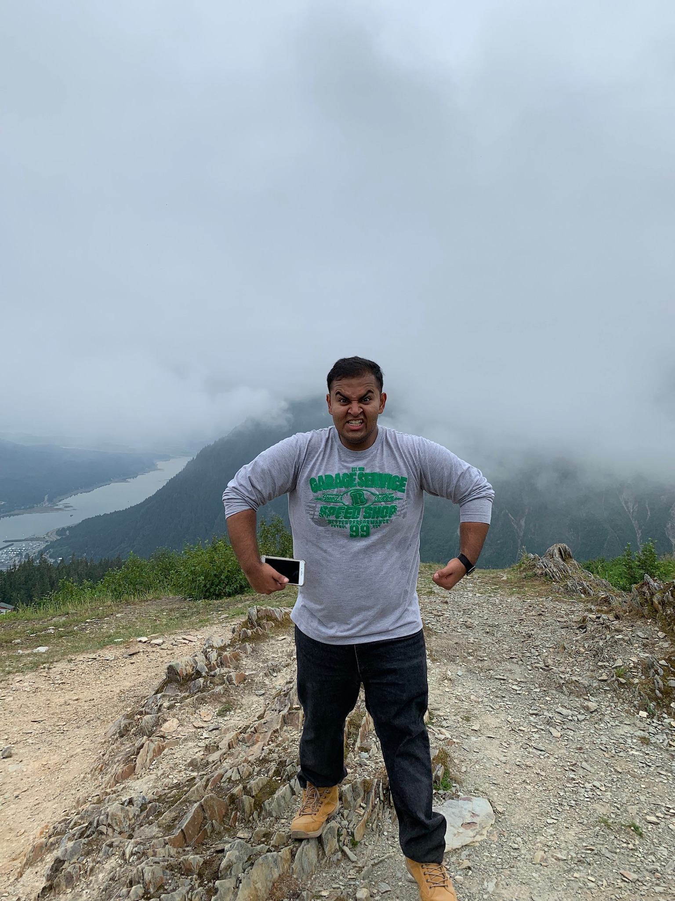

# Sahil Dadhwal

[About Me](#about-me)

[Life Goals](#life-goals)

[Education](#education)

[Organizations](#organizations)

[Languages](#languages)

[Favorite line of code I have ever written](#favorite-line-of-code-i-have-ever-written)

[Links](#links)

## **About Me**
> ##### *I am from San Francisco, California.* 
> ##### *I love to hike.* 
> ##### *The best desination I have traveled to is the state of Alaska, as shown below!* 



## **Life Goals**
> - [ ] *Visit all 50 states*
> - [ ] *Go to Iceland*
> - [ ] *Go skydiving*

## **Education**
#### [University of Califonia - San Diego](https://ucsd.edu/)

>##### *Computer Science (pursuing B.S.)*

> ##### *A notable picture I have taken in San Diego!* 
> #### [Sunset Cliffs](IMG_2349.jpg)

## **Organizations**
#### FIRST Robotics
> ##### *Mentor to a local FTC Robotics team that I co-started in high school.* 

#### UCSD Project RISHI<tr>
> ##### *Member of the Computer Literacy team which was designed to construct a curriculum that promotes computer literacy for students and teachers in rural India.*

#### Sarbat Da Bhala Youth 
> ##### *Co-founder of a non-profit organization designed to reduce the homelessness population in the bay area.*

#### First Step Basketball
> ##### *Volunteer mentor at a youth basketball program targeted towards low income families.*

## **Languages**
1. #### *English*
2. #### *Punjabi*
3. #### *Hindi*
4. #### *Spanish*
## **Favorite line of code I have ever written**
```
System.out.println("Hello World!"); 
```

## **Links**
#### - [GitHub](https://github.com/sahildadhwal)
#### - [Instagram](https://instagram.com/sahildadhwal)
